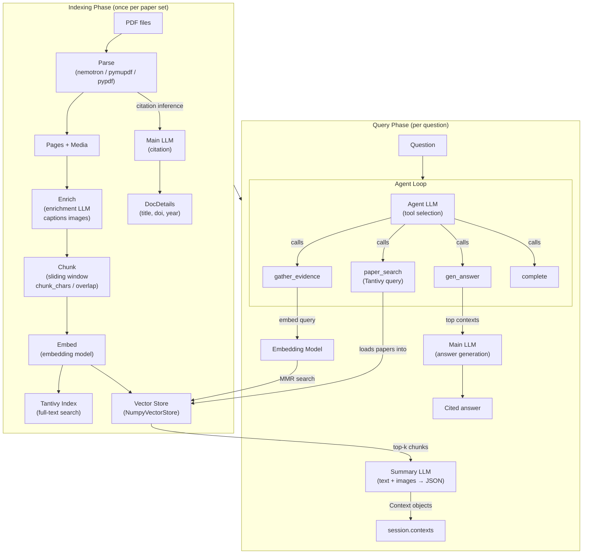
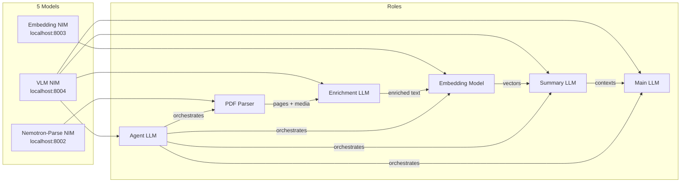
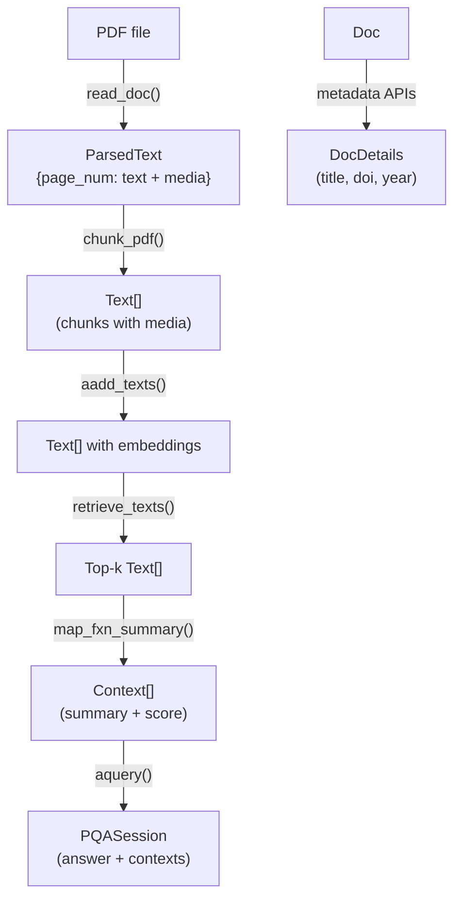

# Paper-QA Architecture Reference

> A single-file reference for the Paper-QA pipeline: how PDFs become answers,
> which LLMs do what, how they connect, and how to configure everything.

---

## Table of Contents

1. [Pipeline at a Glance](#1-pipeline-at-a-glance)
2. [Repository Map](#2-repository-map)
3. [Five Models, Five Roles](#3-five-models-five-roles)
4. [Model Role Details](#4-model-role-details)
5. [PDF Parsing (Stage 1–3)](#5-pdf-parsing-stage-1-3)
6. [Embedding & Indexing (Stage 4–5)](#6-embedding--indexing-stage-4-5)
7. [Retrieval & Evidence (Stage 6–7)](#7-retrieval--evidence-stage-6-7)
8. [Answer Generation (Stage 8)](#8-answer-generation-stage-8)
9. [The Agent Loop](#9-the-agent-loop)
10. [Tools](#10-tools)
11. [Settings Reference](#11-settings-reference)
12. [Configuration Presets](#12-configuration-presets)
13. [Data Types](#13-data-types)
14. [Prompt Templates](#14-prompt-templates)
15. [NVIDIA NIM Deployment](#15-nvidia-nim-deployment)
16. [Mermaid Diagrams](#16-mermaid-diagrams)

---

## 1. Pipeline at a Glance

```
INDEXING (once per paper set)                 QUERY (per question)
──────────────────────────                    ────────────────────
PDF ─► Parse ─► Chunk ─► Enrich ─► Embed     Question
                                    │              │
                              ┌─────┴─────┐        ▼
                              │ Tantivy   │   Agent Loop
                              │ full-text │   ┌─────────────────────────┐
                              │ index     │   │ paper_search (Tantivy)  │
                              └───────────┘   │ gather_evidence (MMR +  │
                              ┌───────────┐   │   summary LLM)          │
                              │ Vector    │   │ gen_answer (main LLM)   │
                              │ store     │   │ complete                │
                              └───────────┘   └─────────────────────────┘
                                                       │
                                                       ▼
                                                  Cited answer
```

| Phase | What happens | Models used |
|-------|-------------|-------------|
| **Parse** | PDF → pages + extracted images/tables | Nemotron-Parse NIM (or PyPDF/PyMuPDF/Docling) |
| **Enrich** | Each image captioned by LLM | Enrichment LLM (vision-capable) |
| **Chunk** | Pages split into overlapping text chunks | — |
| **Embed** | Chunks → vector embeddings | Embedding model |
| **Index** | Full-text (Tantivy) + vector store (Numpy/Qdrant) | — |
| **Retrieve** | Agent calls `paper_search` + `gather_evidence` | Embedding model (query), Agent LLM (tool selection) |
| **Summarize** | Each retrieved chunk summarized against question | Summary LLM (multimodal) |
| **Answer** | Top evidence formatted → final cited answer | Main LLM |

---

## 2. Repository Map

```
paper-qa/
├── src/paperqa/
│   ├── __init__.py              # Public API: Docs, Settings, agent_query, ask
│   ├── core.py                  # LLM JSON parsing, Context creation from summaries
│   ├── docs.py                  # Docs class — document collection + query engine
│   ├── llms.py                  # VectorStore, embedding_model_factory
│   ├── prompts.py               # All prompt templates
│   ├── readers.py               # PDF/HTML/TXT parsing + chunking
│   ├── settings.py              # Settings and all sub-models, factory methods
│   ├── types.py                 # Doc, Text, Context, PQASession, ParsedMedia
│   ├── utils.py                 # Helpers (hexdigest, citation, md5sum)
│   │
│   ├── agents/
│   │   ├── env.py               # PaperQAEnvironment (Aviary Environment)
│   │   ├── helpers.py           # litellm_get_search_query
│   │   ├── main.py              # agent_query, run_agent, run_fake/aviary/ldp_agent
│   │   ├── models.py            # AgentStatus, AnswerResponse
│   │   ├── search.py            # SearchIndex (Tantivy), get_directory_index
│   │   └── tools.py             # PaperSearch, GatherEvidence, GenAnswer, Reset, Complete
│   │
│   ├── clients/                 # Crossref, SemanticScholar, OpenAlex, Unpaywall, etc.
│   ├── configs/                 # Preset JSON: high_quality, fast, debug, clinical_trials, ...
│   └── sources/                 # ClinicalTrials.gov integration
│
├── packages/
│   ├── paper-qa-pypdf/          # PyPDF parser      → paperqa_pypdf.parse_pdf_to_pages
│   ├── paper-qa-pymupdf/        # PyMuPDF parser    → paperqa_pymupdf.parse_pdf_to_pages
│   ├── paper-qa-nemotron/       # Nemotron NIM      → paperqa_nemotron.parse_pdf_to_pages
│   └── paper-qa-docling/        # IBM Docling       → paperqa_docling.parse_pdf_to_pages
│
└── pyproject.toml               # Extras: [pymupdf], [nemotron], [docling], [ldp], [qdrant]
```

---

## 3. Five Models, Five Roles

```
Settings (settings.py)
│
├── .llm / .llm_config                    → get_llm()             → MAIN LLM
├── .summary_llm / .summary_llm_config    → get_summary_llm()     → SUMMARY LLM
├── .agent.agent_llm / .agent_llm_config  → get_agent_llm()       → AGENT LLM
├── .parsing.enrichment_llm / _config     → get_enrichment_llm()  → ENRICHMENT LLM
└── .embedding / .embedding_config        → get_embedding_model() → EMBEDDING MODEL
```

| Role | Default | Input modalities | Output | Primary call site |
|------|---------|-----------------|--------|-------------------|
| **Main LLM** | gpt-4o | text | answer with citations | `docs.py` → `Docs.aquery()` |
| **Summary LLM** | gpt-4o | text + images | JSON `{summary, relevance_score}` | `core.py` → `map_fxn_summary()` |
| **Agent LLM** | gpt-4o | text | tool calls `{name, args}` | `main.py` → `run_aviary_agent()` |
| **Enrichment LLM** | gpt-4o | text + 1 image | `RELEVANT: description` or `IRRELEVANT` | `settings.py` → `make_media_enricher()` |
| **Embedding** | text-embedding-3-small | text | float vector | `docs.py` → `Docs.aadd_texts()` |

### Minimum capabilities per role

| Role | Must support |
|------|-------------|
| **Main LLM** | Text completion, instruction following |
| **Summary LLM** | Text + JSON output; **vision** if multimodal is on |
| **Agent LLM** | **Function/tool calling** (required) |
| **Enrichment LLM** | **Vision/multimodal** (always receives 1 image) |
| **Embedding** | Text → vector encoding |

---

## 4. Model Role Details

### 4.1 Main LLM

Called in 5 places:

| # | Purpose | File | Input | Output |
|---|---------|------|-------|--------|
| 1 | Citation inference | `docs.py` `Docs.aadd()` | First chunk of paper | MLA citation string |
| 2 | Structured citation | `docs.py` `Docs.aadd()` | MLA citation | JSON `{title, authors, doi}` |
| 3 | Pre-answer (optional) | `docs.py` `Docs.aquery()` | Question + `pre` prompt | Background info |
| 4 | **Answer generation** | `docs.py` `Docs.aquery()` | Contexts + question + `qa_prompt` | Cited answer |
| 5 | Post-answer (optional) | `docs.py` `Docs.aquery()` | Answer + `post` prompt | Refined answer |

### 4.2 Summary LLM

Called in 1 place (per retrieved chunk, parallelized):

| Purpose | File | Input | Output |
|---------|------|-------|--------|
| Evidence summarization | `core.py` `_map_fxn_summary()` | Chunk text + images + question | `{"summary": "...", "relevance_score": 0-10}` |

This is the **primary multimodal LLM** — it receives raw images alongside text chunks
during `gather_evidence`.

### 4.3 Agent LLM

Consumed by the agent runtime (Aviary ToolSelector or LDP SimpleAgent). Each step:
1. Receives full message history + tool schemas
2. Returns a `ToolRequestMessage` with one or more tool calls
3. Never sees images directly — only text tool outputs

### 4.4 Enrichment LLM

Called once per extracted image during PDF parsing:
- Input: 1 image + surrounding page text (configurable radius)
- Output: `"RELEVANT: This figure shows..."` or `"IRRELEVANT: Journal logo"`
- Irrelevant media is filtered out before chunking
- Enriched descriptions are appended to chunk text for embedding

### 4.5 Embedding Model

| # | Purpose | Call site |
|---|---------|-----------|
| 1 | Chunk embedding (eager) | `docs.py` `Docs.aadd_texts()` |
| 2 | Chunk embedding (lazy) | `docs.py` `Docs._build_texts_index()` |
| 3 | Query embedding | `llms.py` `NumpyVectorStore.similarity_search()` |

Supports query/document mode distinction (e.g. `input_type: "passage"` vs `"query"`
for NVIDIA embeddings).

Model routing by prefix:

| Prefix | Class | Example |
|--------|-------|---------|
| *(none)* | LiteLLMEmbeddingModel | `text-embedding-3-small` |
| `openai/` | LiteLLMEmbeddingModel | `openai/nvidia/llama-3.2-nv-embedqa-1b-v2` |
| `st-` | SentenceTransformerEmbeddingModel | `st-all-MiniLM-L6-v2` |
| `hybrid-` | HybridEmbeddingModel | `hybrid-text-embedding-3-small` |
| `sparse` | SparseEmbeddingModel | `sparse` |

---

## 5. PDF Parsing (Stage 1–3)

### 5.1 Dispatch (`readers.py` → `read_doc()`)

| Extension | Parser |
|-----------|--------|
| `.pdf` | `ParsingSettings.parse_pdf` (pluggable) |
| `.txt` | `parse_text()` |
| `.html` | `parse_text(html=True)` via html2text |
| `.png`, `.jpg` | `parse_image()` → single ParsedMedia |
| `.docx`, `.xlsx` | `parse_office_doc()` via unstructured |

### 5.2 Available PDF Parsers

| Parser | Package | Multimodal | Best for |
|--------|---------|-----------|----------|
| **PyPDF** | `paper-qa-pypdf` | No | Simple text PDFs |
| **PyMuPDF** | `paper-qa-pymupdf` | Yes (raster) | General PDFs |
| **Nemotron** | `paper-qa-nemotron` | Yes (VLM bbox) | Scientific papers |
| **Docling** | `paper-qa-docling` | Yes (structural) | Structured documents |

Install: `pip install paper-qa[pymupdf]` / `[nemotron]` / `[docling]`

### 5.3 Nemotron Parser Flow

```
PDF page → render at DPI → add 60px border → base64 PNG
    → Nemotron-Parse NIM (markdown_bbox tool)
    → markdown text + bounding boxes + type labels
    → crop figures/tables from original image → ParsedMedia
    → page text + list[ParsedMedia]
```

Key `reader_config` params: `dpi` (default 150–300), `chunk_chars`, `overlap`,
`failover_parser`, `api_params` (api_base, api_key, model_name, temperature, max_tokens).

### 5.4 Chunking (`readers.py` → `chunk_pdf()`)

Page-aware sliding window: accumulates page text, splits at `chunk_chars` boundary
with `overlap` carry-forward. Each chunk inherits all `ParsedMedia` from its page range.

### 5.5 Media Enrichment (`settings.py` → `make_media_enricher()`)

For each extracted image:
1. Gather context text from surrounding pages (radius = `enrichment_page_radius`)
2. Send image + context to enrichment LLM
3. Parse response: `RELEVANT: ...` → keep + store description, `IRRELEVANT` → discard
4. Description is appended to chunk text for embedding via `Text.get_embeddable_text()`

---

## 6. Embedding & Indexing (Stage 4–5)

### 6.1 Embedding

```python
# docs.py — Docs.aadd_texts() (simplified)
embeddable_texts = [t.get_embeddable_text(with_enrichment=True) for t in texts]
embeddings = await embedding_model.embed_documents(embeddable_texts)
for t, emb in zip(texts, embeddings):
    t.embedding = emb  # list[float]
```

Enriched descriptions are embedded alongside chunk text — queries about "bar chart
showing gene expression" retrieve chunks whose enrichment mentions bar charts.

### 6.2 Two Indexes

| Index | Purpose | Technology | Used by |
|-------|---------|-----------|---------|
| **Tantivy** (full-text) | Find *which papers* match a query | Rust search engine | `paper_search` tool |
| **VectorStore** | Find *which chunks* are most relevant | NumpyVectorStore / Qdrant | `gather_evidence` tool |

Tantivy schema: `{file_location, body, title, year}`. Each entry stores a pickled
`Docs` object with pre-embedded text chunks.

---

## 7. Retrieval & Evidence (Stage 6–7)

### 7.1 paper_search

```
Agent → paper_search(query) → Tantivy full-text search
    → top-N Docs objects (pre-chunked papers)
    → add their Text chunks to agent's working VectorStore
```

### 7.2 gather_evidence

```
Agent → gather_evidence(question)
    → embed question → cosine similarity + MMR → top-k chunks
    → for each chunk (parallel):
        summary_llm(chunk_text + images + question)
            → {"summary": "...", "relevance_score": 8}
            → Context(context=summary, score=8, text=chunk)
    → append to session.contexts
```

MMR (Maximal Marginal Relevance) controls diversity:
- `texts_index_mmr_lambda = 1.0` → pure relevance (default)
- `texts_index_mmr_lambda = 0.5` → balanced

---

## 8. Answer Generation (Stage 8)

`Docs.aquery()` in `docs.py`:

1. Sort contexts by `(-score, name)`, take top `answer_max_sources` (default 5)
2. Filter by `evidence_relevance_score_cutoff` (default 1)
3. Format each context with a citation key: `pqac-{hash}: {summary}\nFrom {citation}`
4. Build prompt: system prompt + formatted contexts + question + qa_prompt
5. Main LLM generates answer with inline citation keys like `(pqac-d79ef6fa)`
6. Post-process: resolve citation keys → bibliography

---

## 9. The Agent Loop

Paper-QA uses a simple while-loop (not a graph/state machine). The agent LLM decides
which tool to call each step.

```
agent_query(question, settings)
│
├── Build Tantivy search index (if needed)
├── Create PaperQAEnvironment(query, settings, docs)
├── env.reset() → initial observations + tool list
│
├── Agent loop (until done or max_timesteps):
│   │  observations → agent LLM → tool call(s)
│   │  → env.step(action) → execute tool → new observations
│   └── repeat
│
├── If truncated: force gen_answer as failover
└── Return AnswerResponse(session, status)
```

Typical tool call sequence:
```
1. paper_search("CRISPR efficiency")
2. paper_search("CRISPR off-target effects")
3. gather_evidence("What is the efficiency of CRISPR?")
4. gather_evidence("What are the off-target effects?")
5. gen_answer()
6. complete(has_successful_answer=True)
```

### Agent Types

| Type | Setting | How it works |
|------|---------|-------------|
| **ToolSelector** (default) | `agent_type="ToolSelector"` | Aviary LLM-based tool selector |
| **Fake** | `agent_type="fake"` | Deterministic: 3 searches → gather → answer |
| **LDP SimpleAgent** | `agent_type="ldp.agent.SimpleAgent"` | LDP RolloutManager drives the loop |

---

## 10. Tools

| Tool | Class | Method signature | What it does |
|------|-------|-----------------|-------------|
| **paper_search** | `PaperSearch` | `paper_search(query, min_year, max_year)` | Queries Tantivy index, adds matched paper chunks to working Docs |
| **gather_evidence** | `GatherEvidence` | `gather_evidence(question)` | Retrieves top-k chunks via embedding similarity, LLM-summarizes each into Context |
| **gen_answer** | `GenerateAnswer` | `gen_answer()` | Selects top contexts, generates cited answer via main LLM |
| **reset** | `Reset` | `reset()` | Clears session contexts (when gathered evidence is unsuitable) |
| **complete** | `Complete` | `complete(has_successful_answer)` | Signals the agent is done |
| **clinical_trials_search** | `ClinicalTrialsSearch` | `clinical_trials_search(query)` | Optional. Searches ClinicalTrials.gov |

Default set: `paper_search, gather_evidence, gen_answer, reset, complete`.
Override via `AgentSettings.tool_names` or `PAPERQA_DEFAULT_TOOL_NAMES` env var.

---

## 11. Settings Reference

### Top-level Settings

| Field | Type | Default |
|-------|------|---------|
| `llm` | str | `gpt-4o` |
| `llm_config` | dict \| None | None |
| `summary_llm` | str | `gpt-4o` |
| `summary_llm_config` | dict \| None | None |
| `embedding` | str | `text-embedding-3-small` |
| `embedding_config` | dict \| None | None |
| `temperature` | float | 0.0 |
| `batch_size` | int | 1 |
| `texts_index_mmr_lambda` | float | 1.0 |
| `verbosity` | int | 0 |
| `answer` | AnswerSettings | (see below) |
| `parsing` | ParsingSettings | (see below) |
| `prompts` | PromptSettings | (see below) |
| `agent` | AgentSettings | (see below) |

### AnswerSettings

| Field | Default | Effect |
|-------|---------|--------|
| `evidence_k` | 10 | Chunks to retrieve per `gather_evidence` |
| `answer_max_sources` | 5 | Max contexts in answer prompt |
| `answer_length` | "about 200 words" | Instructed answer length |
| `evidence_summary_length` | "about 100 words" | Instructed summary length |
| `max_concurrent_requests` | 4 | Parallel LLM calls for summarization |
| `evidence_relevance_score_cutoff` | 1 | Min score to keep evidence |
| `evidence_skip_summary` | False | Skip summarization, use raw chunks |

### ParsingSettings

| Field | Default | Effect |
|-------|---------|--------|
| `parse_pdf` | auto-detect | Parser function or dotted path |
| `reader_config` | `{}` | Passed to parser: `chunk_chars`, `overlap`, `dpi`, `api_params`, `failover_parser` |
| `multimodal` | `ON_WITH_ENRICHMENT` | Extract + enrich images |
| `enrichment_llm` | `gpt-4o` | LLM for image captioning |
| `enrichment_llm_config` | None | Router config for enrichment LLM |
| `enrichment_page_radius` | 1 | Pages of context for enrichment |
| `use_doc_details` | True | Query metadata APIs (Crossref, etc.) |
| `defer_embedding` | False | Embed on add vs. on first query |

### AgentSettings

| Field | Default | Effect |
|-------|---------|--------|
| `agent_llm` | `gpt-4o` | LLM for tool selection |
| `agent_llm_config` | None | Router config for agent LLM |
| `agent_type` | `ToolSelector` | Agent type |
| `search_count` | 8 | Papers per search query |
| `max_timesteps` | None | Max agent steps |
| `timeout` | 500.0 | Agent timeout (seconds) |
| `tool_names` | None (all default) | Which tools are available |
| `agent_evidence_n` | 1 | Top evidence shown to agent per gather |
| `index` | IndexSettings | Paper directory, index directory |

### IndexSettings

| Field | Default | Effect |
|-------|---------|--------|
| `paper_directory` | (required) | Directory containing PDFs |
| `index_directory` | None (auto) | Where Tantivy index is stored |

### Factory Methods (settings.py)

| Method | Returns | Configured by |
|--------|---------|--------------|
| `get_llm()` | LiteLLMModel | `llm` + `llm_config` |
| `get_summary_llm()` | LiteLLMModel | `summary_llm` + `summary_llm_config` |
| `get_agent_llm()` | LiteLLMModel | `agent.agent_llm` + `agent.agent_llm_config` |
| `get_enrichment_llm()` | LiteLLMModel | `parsing.enrichment_llm` + `parsing.enrichment_llm_config` |
| `get_embedding_model()` | EmbeddingModel | `embedding` + `embedding_config` |
| `make_aviary_tool_selector()` | ToolSelector | wraps agent LLM |
| `make_ldp_agent()` | LDP Agent | wraps agent LLM |
| `make_media_enricher()` | async callable | wraps enrichment LLM |

---

## 12. Configuration Presets

Load via `Settings.from_name("preset_name")`.

| Preset | Description |
|--------|------------|
| `high_quality` | Larger chunks (7000), more evidence (20) |
| `fast` | Smaller/faster defaults |
| `debug` | Debug settings |
| `clinical_trials` | Adds ClinicalTrialsSearch tool |
| `wikicrow` / `contracrow` | Wikipedia-style generation |
| `openreview` | OpenReview paper review |
| `tier1_limits` – `tier5_limits` | Rate-limited configurations |

---

## 13. Data Types

All defined in `types.py`:

```
Doc / DocDetails
├── docname: str              # Human-readable name
├── dockey: Any               # Unique key (content hash)
├── citation: str             # Full citation string
└── (DocDetails: title, doi, year, authors, journal, ...)

Text (extends Embeddable)
├── text: str                 # Chunk text content
├── name: str                 # "docname pages X-Y"
├── doc: Doc                  # Parent document
├── embedding: list[float]    # Vector embedding
└── media: list[ParsedMedia]  # Associated images/tables

Context
├── text: Text                # Source chunk
├── context: str              # LLM-generated summary
├── score: int                # Relevance (0-10)
└── question: str             # Question this answers

PQASession
├── question: str             # Original question
├── answer: str               # Generated answer
├── contexts: list[Context]   # Gathered evidence
├── tool_history: list        # Record of tool calls
└── cost: float               # Total LLM cost

ParsedMedia
├── index: int                # Position on page
├── data: bytes               # Image as PNG
├── info: dict                # enriched_description, is_irrelevant, ...
└── text: str                 # Table markdown (if table)
```

---

## 14. Prompt Templates

Key templates in `prompts.py`:

| Variable | Used by | Purpose |
|----------|---------|---------|
| `citation_prompt` | Main LLM | Infer MLA citation from first chunk |
| `structured_citation_prompt` | Main LLM | Extract `{title, authors, doi}` JSON |
| `default_system_prompt` | Main LLM | "Answer in a direct and concise tone..." |
| `qa_prompt` | Main LLM | "Answer the question below with the context..." |
| `summary_json_system_prompt` | Summary LLM | "Provide a summary... `{summary, relevance_score}`" |
| `summary_json_prompt` | Summary LLM | "Excerpt from {citation}... Question: {question}" |
| `env_system_prompt` | Agent LLM | "You are a helpful AI assistant." |
| `env_reset_prompt` | Agent LLM | "Use the tools to answer the question: {question}" |
| `individual_media_enrichment_prompt_template` | Enrichment LLM | "You are analyzing an image... RELEVANT/IRRELEVANT" |
| `CONTEXT_OUTER_PROMPT` | Answer formatting | "{context_str}\n\nValid Keys: {valid_keys}" |
| `CONTEXT_INNER_PROMPT` | Answer formatting | "{name}: {text}\nFrom {citation}" |

---

## 15. NVIDIA NIM Deployment

### Model Mapping

| Paper-QA Role | NVIDIA Model | NIM / Endpoint |
|---------------|-------------|----------------|
| PDF Parser | nvidia/nemotron-parse | localhost:8002 (self-hosted NIM) |
| Embedding | nvidia/llama-3.2-nv-embedqa-1b-v2 | localhost:8003 or inference-api.nvidia.com |
| Main LLM | nvidia/nemotron-nano-12b-v2-vl | localhost:8004 (self-hosted NIM) |
| Summary LLM | nvidia/nemotron-nano-12b-v2-vl | localhost:8004 |
| Agent LLM | nvidia/nemotron-nano-12b-v2-vl | localhost:8004 |
| Enrichment LLM | nvidia/nemotron-nano-12b-v2-vl | localhost:8004 |

All LLMs route through **LiteLLM** via the `openai/` prefix and `api_base` in config.

### Settings Example

```python
from paperqa import Settings
from paperqa.settings import AgentSettings, AnswerSettings, ParsingSettings
from paperqa_nemotron import parse_pdf_to_pages

def _router(alias, model, base_url, api_key):
    return {"model_list": [{"model_name": alias, "litellm_params": {
        "model": f"openai/{model}", "api_base": base_url,
        "api_key": api_key, "temperature": 0, "max_tokens": 24576,
    }}]}

VLM = "nvidia/nemotron-nano-12b-v2-vl"
VLM_URL = "http://localhost:8004/v1"
API_KEY = "not-used"

settings = Settings(
    llm="pqa-llm",
    llm_config=_router("pqa-llm", VLM, VLM_URL, API_KEY),
    summary_llm="pqa-summary",
    summary_llm_config=_router("pqa-summary", VLM, VLM_URL, API_KEY),
    embedding="openai/nvidia/llama-3.2-nv-embedqa-1b-v2",
    embedding_config={"kwargs": {
        "api_base": "http://localhost:8003/v1",
        "api_key": API_KEY,
        "encoding_format": "float",
        "input_type": "passage",
    }},
    parsing=ParsingSettings(
        parse_pdf=parse_pdf_to_pages,
        multimodal=True,
        enrichment_llm="pqa-enrich",
        enrichment_llm_config=_router("pqa-enrich", VLM, VLM_URL, API_KEY),
        reader_config={
            "chunk_chars": 5000,
            "overlap": 250,
            "dpi": 150,
            "failover_parser": "paperqa_pymupdf.parse_pdf_to_pages",
            "api_params": {
                "api_base": "http://localhost:8002/v1",
                "api_key": API_KEY,
                "model_name": "nvidia/nemotron-parse",
                "temperature": 0,
                "max_tokens": 8995,
            },
        },
    ),
    agent=AgentSettings(
        agent_llm="pqa-agent",
        agent_llm_config=_router("pqa-agent", VLM, VLM_URL, API_KEY),
    ),
)
```

### CLI Example

```bash
NVIDIA_INFERENCE_KEY=... python test_PQA_singlePDF.py \
    --parse-base-url http://localhost:8002/v1 \
    --embedding-base-url https://inference-api.nvidia.com/v1 \
    --vlm-base-url http://localhost:8004/v1 \
    --vlm-model nvidia/nemotron-nano-12b-v2-vl \
    --llm-model nvidia/nvidia/nemotron-3-super-v3 \
    --llm-base-url https://inference-api.nvidia.com/v1 \
    --agent-llm-model nvidia/nvidia/nemotron-3-super-v3 \
    --agent-llm-base-url https://inference-api.nvidia.com/v1 \
    --trace
```

---

## 16. Mermaid Diagrams

### End-to-End Flow



### Model Dependency Graph



### Data Flow Through Types


